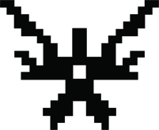
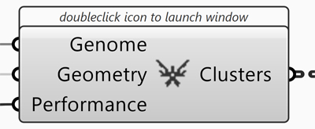
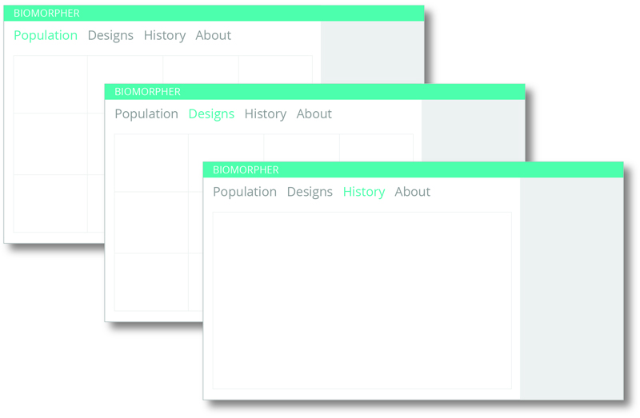
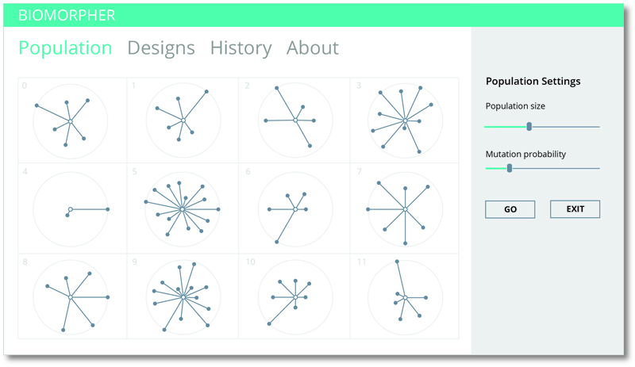
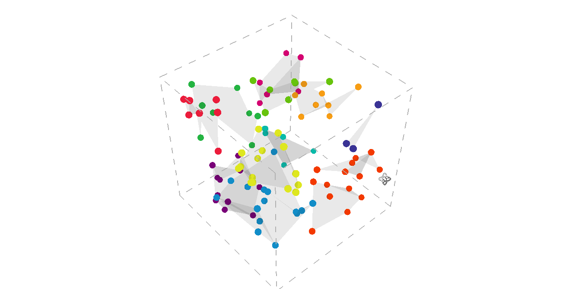
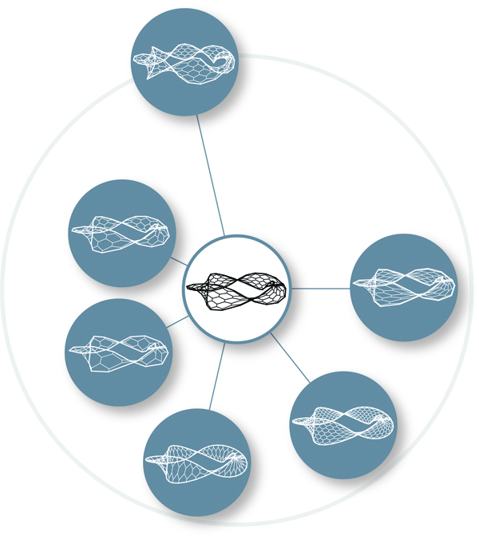
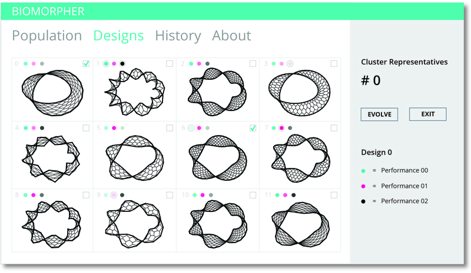
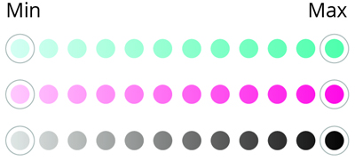

# BIOMORPHER DOCUMENTATION

v 0.1.1

## ABOUT

There currently exists several metaheuristic algorithms in Grasshopper that use defined fitness functions in order to guide a design search. In contrast, Biomorpher allows the user to navigate an evolutionary search via interactive selection, allowing designs to survive that can sometimes just 'feel right' rather than measuring against performance metrics. As opposed to stepping back from how a problem is solved (OK Computer), during an interactive search human and machine form a narrative together whilst navigating the 'paradox of choice' of multi-dimensional parametric models.

## COMPONENT OVERVIEW

The Biomorpher component is located under the *Prm* tab in the *Util* group (next to e.g. Galapagos and Octopus).

#### Input
* Genome: The parameters that will be tweaked during the design evolution. These can be numeric sliders or genepools (similar to Galapagos)
* Geometry: The geometry that is generated from those parameters (phenotype). Currently Biomorpher only supports mesh geometry but this will be improved in later versions.
* Performance: Optional performance values that are related to the phenotype e.g. floor area, volume, daylight factor, maximum deflection etc. There is no limit to how many performance values that can be added but it is recommended to keep this to a manageable size (max 8). The nickname of the connected parameter output will be shown inside the component.

#### Output
* Clusters: The normalised genes are output as a tree structure of type {X;Y} where *X* is the cluster id and *Y* is the specific design number. The number of designs may vary from cluster to cluster. The items in each branch are the genes.

#### Double-click

A new window is launched when the Biomorpher component is double-clicked. It contains three main tabs: Population, Designs and History. They are all related but show different levels of the design exploration process.

## POPULATION

The population tab is initially empty until the settings are specified and the *GO* button is pressed.

#### Settings
* Population size: This number specifies the number of different designs options that will be generated automatically by tweaking the sliders/genepools. The number has to be larger than 12 as this is the predetermined number of designs that are displayed. Ideally, the number is bigger than that to provide sufficient variation in the population. However, a large number requires more computation time so this has to be balanced. By default the population size is set to 100. The population size is set at the beginning and cannot be changed during the design exploration process.
* Mutation probability: A number between 0.00 to 1.00, which specifies how likely the genes of a design are to change (as a percentage). A small number means that almost no mutation occurs and hence a comparison between the designs of two consecutive generations will show very similar (or identical) results. If the number is too high, the design exploration becomes almost random. By default this value is set to 0.01 but can be changed during evolution.

#### K-means

K-Means is one of the simplest machine learning algorithms used to cluster data into a predefined number of groups. For this application, it is used to cluster the population into 12 groups with similar genes, which helps to make the design space less overwhelming (displaying a population of 100+ designs is not straightforward). The user only has to inspect 12 designs no matter how big the population is in order to get an overview of the design space. The K-means clustering algorithm operates in n-dimensional space, where *n* is the number of genes. The animation above shows the clustering result of a population where the design is defined by three parameters (genes) and hence can be visualised in 3d. To ensure an efficient choice of initial centroids, a K-Means++ algorithm has been implemented. 

#### Representative

The population tab visualises the entire population and how it has been grouped into 12 different clusters. Each design is displayed as a dot (since it would become overwhelming to show the actual geometry of each) so the total number of dots corresponds to the population size. Each cluster contains at least one dot but the number varies from cluster to cluster (depending on how closely related the designs are). The ordering of the clusters i.e. the relation between them has no meaning. However, within each cluster it is possible to determine the dot (design) that is closest to the centroid and this is referred to as the *representative design*. In other words, this is the design that best represents all the designs within its cluster. The representative design is the dot at the centre and the distances to the other dots represent the normalised euclidean distances between them.

## DESIGNS

The designs tab visualises the actual geometry (phenotype) of the 12 representative designs such that the design inside rectangle 0 corresponds to the dot in the centroid of rectangle 0 in the Population tab. Each rectangle is an actual viewport, which makes it possible to investigate each design by orbiting around it. Additionally, it is possible to view the Grasshopper instance of each design inside Rhino for a larger view by double-clicking a viewport.

#### Evolution
The count value in the side panel indicates which generation is currently displayed. After the user has investigated the 12 designs, one (or more) has to be selected via the checkboxes to create the next generation. The selected designs can therefore be thought of as the parents, whose genes are used in the evolutionary process. The next generation is created based on mutations of each of the parents' genes with an additional weighting according to how many designs that are contained in the corresponding cluster.
When the user is satisfied with the parent selection, the *Evolve* button has to be pressed to advance to the next generation. Note that the generation count increases accordingly.

#### Performance

The parent selection can be based on pure aesthetics or it can be guided by some performance measurements. These performance values are initially supplied via the input to the component but are automatically calculated by triggering the Grasshopper canvas to recalculate for each design instance. This means that other plug-ins such as Karamba and Honeybee can be used to generate qualitative measurements that can be compared and evaluated amongst the design options inside the Biomorpher window. Each performance measurement is colour coded in the side panel and a gradient of this colour exists above each design. This can be used to quickly get an overview of how the different designs perform compared to each other. Low values are assigned with a vague colour and high values with a vivid colour. The minimum and maximum of a certain performance measurement are additionally highlighted with a grey circle. By double-clicking a viewport, the more detailed performance information related to a specific design can be accessed.

This selection process continues until the user has reached a satisfactory design.

## HISTORY
Contains a historical record of choices made by the designer. Previous populations can be accessed and reinstated, thus forming a new evolutionary branch. Each such branch is recorded separately and displayed in a new column. The display can also be exported to an image file for printing and discussion.

## REFERENCES
* "The Blind Watchmaker: Why the Evidence of Evolution Reveals a Universe without Design" by Richard Dawkins, 1986
* http://www.mountimprobable.com/
* http://www.emergentmind.com/biomorphs
* http://datascience.stackexchange.com/questions/5656/k-means-what-are-some-good-ways-to-choose-an-efficient-set-of-initial-centroids